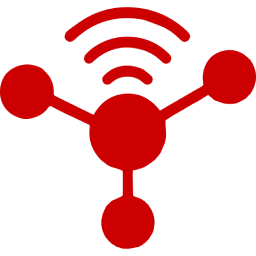
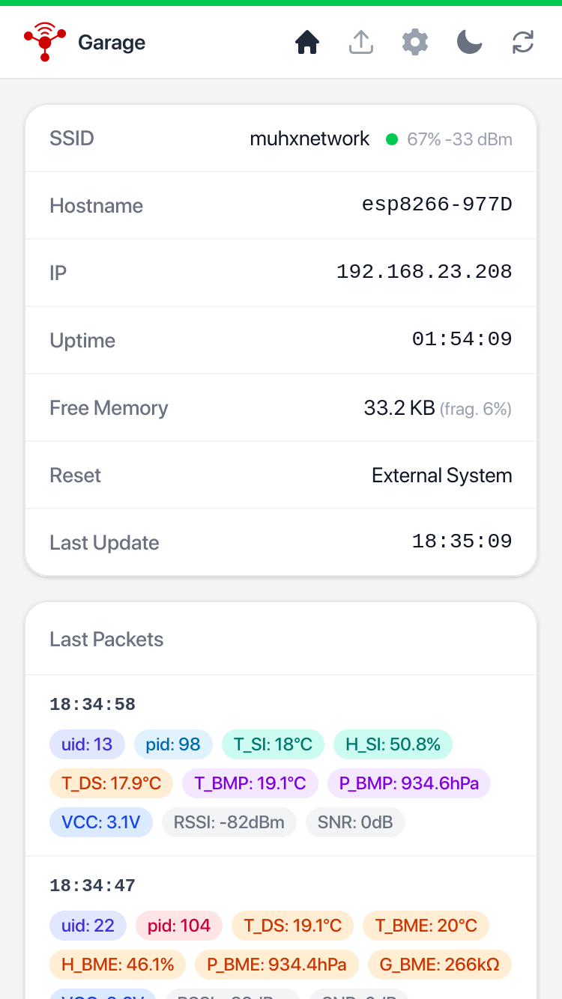
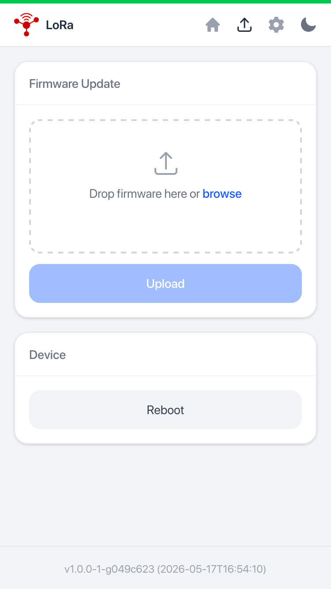
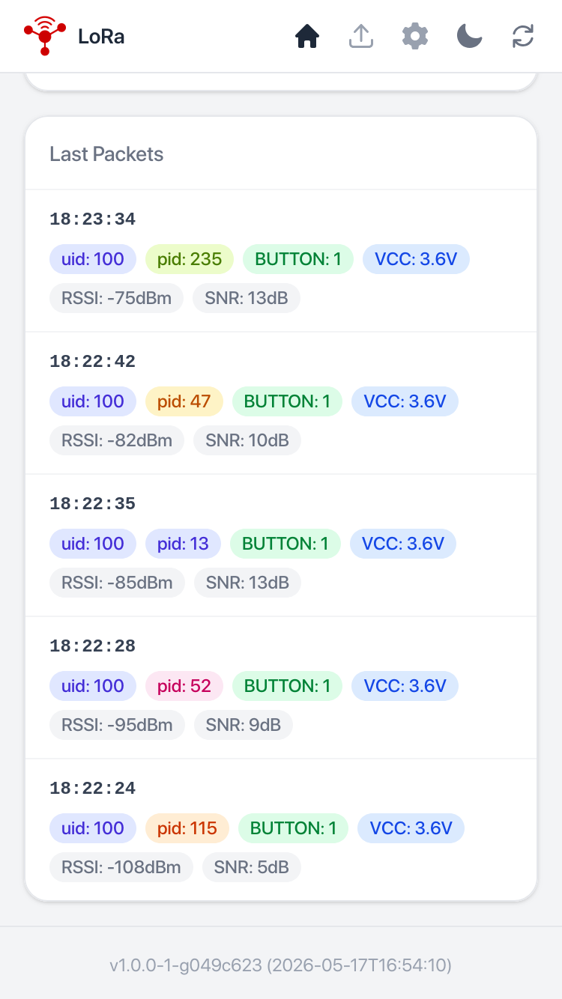

#  muhradio

A home sensor network with battery-powered transmitter nodes reporting sensor
data to one or more receivers that push it to MQTT and a live web UI.
Supports two radio transports: **LoRa** (SX1276/RFM95W) and **CC1101**.

<p align="center">
  
  
  
</p>

```
┌──────────────────────┐  CC1101 868.32 MHz  ┌──────────────────────────────┐
│   Transmitter node   │ ──────────────────► │  Receiver (ESP32 / ESP8266)  │
│  (Arduino Pro Mini)  │    binary packet     │                              │
│                      │  [dst][src]          │  ┌────────────────────────┐  │
│  Sensors:            │  [uid:2][pid:1]      │  │ MQTT                   │  │
│    Si7021 / DS18B20  │  [bitmap:2]          │  │  CC1101 → port 1881    │  │
│    BMP280 / BME680   │  [fields...]         │  │  LoRa   → port 1883    │  │
│    PIR / radar       │                      │  └────────────────────────┘  │
│    button / switch   │  LoRa 868 MHz        │  ┌────────────────────────┐  │
│    VCC (battery)     │ ──────────────────►  │  │ Web UI / WebSocket     │  │
└──────────────────────┘                      │  └────────────────────────┘  │
                                              └──────────────────────────────┘
```

Multiple CC1101 receivers can run in parallel — they publish to MQTT port 1881
and a Node-RED flow deduplicates by `uid+pid` (60 s TTL) before forwarding
to port 1883.

## Subdirectories

| Path | Description |
|---|---|
| [transmitter/](transmitter/) | Arduino Pro Mini sensor node (LoRa or CC1101) |
| [receiver/](receiver/) | ESP32 / ESP8266 gateway — MQTT, WebSocket, OTA |

## Wire format

Packets are compact binary frames:

```
[dst:1] [src:1] [uid:2] [pid:1] [bitmap:2] [field values ...]
```

- `uid` — 12-bit node identity (`CUSTOM_UID` hex or random at first boot)
- `pid` — 8-bit packet ID (1–255, random per transmission, used for dedup)
- `bitmap` — 16-bit field presence mask; each set bit adds one typed field
- Fields appear in bit order, only present bits, no headers

Optional AES-128 ECB encryption (PKCS#7 padding) is enabled by setting
`AES_KEY` in `pio_secrets.py` on **both** transmitter and receiver.

See [transmitter/README.md](transmitter/README.md) for the full field table.

## Quick start

### Transmitter

```sh
cd transmitter
cp pio_secrets_example.py pio_secrets.py   # add AES_KEY if using crypto
pio run -e cc1101_button -t upload
```

### Receiver

```sh
cd receiver
cp pio_secrets_example.py pio_secrets.py   # WIFI_PASS, MQTT_PASS, AES_KEY
pio run -e d1_mini -t upload     # flash firmware
pio run -e d1_mini -t uploadfs   # flash web UI (LittleFS)
```

Browse to `http://esp8266-XXXX.local` once the device is online.
The nav bar shows the configured **Description** (set in Settings); hostname and
IP appear in the status card.

For board-specific wiring, OTA instructions, and the multi-receiver dedup setup
see [receiver/README.md](receiver/README.md).

## Factory flashing (single binary)

```sh
cd receiver
pio run && pio run -t buildfs && pio run -t mergebin
esptool.py --chip auto write_flash 0x0 .pio/build/esp32-s3-zero/merged.bin
```

For web OTA (firmware + filesystem in one upload via `/update.html`):

```sh
pio run && pio run -t buildfs && pio run -t otabundle
# upload .pio/build/<env>/ota_bundle.bin via /update.html
```

## License

MIT
